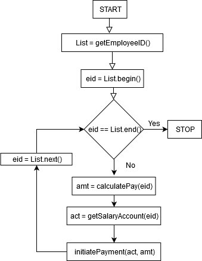

### Q1.c

**Polymorphism**

Polymorphism refers to the design that enables an object or a method to take on multiple forms. It is also applicable to methods where they can take on 
multiple forms depending on some factors.

In the context of class, Polymorphism allows us to use an instance of the child class to initialize or assign to a parent class reference variable, This type of polymorphism is also known as subtype polymorphism, as the child class will be a subtype of the parent class. 

The two other types of polymorphism are - Runtime polymorphism and Compile-time polymorphism. Runtime polymorphism occurs when a method in the parent class is overridden by the child class. Now, the function call will be resolved at runtime depending on the instance being used. It is also known as Function overriding. Compile time polymorphism includes function overloading and operator overloading.


 It occurs when the same function name is used in the multiple function definitions. Which function to be called will be resolved depending on the number and type of parameters used in the function call.  

<br/>

**Good use:**

One of the good uses of polymorphism is that it can refer to interfaces instead of implementations. Here the interface acts as a parent class in terms of its role, but it is not a class. In the below code, if we use a specific implementation of List\<String> such as ArrayList or LinkedList as the return type, then the method getAllModelNames() is restricted to use that specific implementation. Instead, if we use List\<String> then getAllModelNames() is given the choice of using any class implementation according to its requirement.

```java
class HondaCar {
    public List<String> getAllModelNames() {
        // method definition
    }
}
```

<br/>

**Bad use:**

Suppose the requirement is that we want to restrict the child class from overriding some methods of parent class. We cannot achieve this because of the runtime polymorphism capability available in Object-oriented programming. So, this is an example where polymorphism is used incorrectly. The below example needs to use the 'final' keyword to prevent subclasses from overriding the implementation of method1().

```java
class A {
    public void method1() {
        // Method definition
    }
}

class B extends A {
    public void method1() {
        // Method definition
    }
    // Here method1() is being overridden by the child class B
}
```


(Web Reference used for this answer - https://www.tutorialspoint.com/java/java_polymorphism.htm)

<br/>


### Q1.d

**Cohesion**

Cohesion indicates the degree to which a class or function has a single, well-focused purpose. In the context of Object-oriented classes, if a class has low cohesion, then it means that it is performing multiple tasks. On the other hand, if it has high cohesion, then it means that it has one single and well-focused responsibility. Higher cohesiveness leads to better design. The same is applicable to methods or functions in the program.


<br/>

**Bad use of cohesion:**

The below code snippet shows a class with less cohesiveness which has the responsibility of multiple unrelated tasks. Here, HondaCrv class maintains a list of the customers who bought it. Logically, the task of maintaining customer names should not be the responsibility of HondaCrv class. So this class has low cohesion.


```java
class HondaCrv {
    private List<String> customerNames;
    public HondaCrv() {
        customerNames = new ArrayList<>();
    }
    public List<String> getCustomers() {
        return customerNames;
    }
    public void addCustomer(String customerName) {
        customerNames.add(customerName);
    }
    // other variables and methods definition of HondaCrv class
}
```

<br/>

**Good use of cohesion:**

One of the good use of cohesion is where the class has high cohesion and has only one and well-focused responsibility. The ‘HondaCrv’ class has the behavior and properties related to Honda CRV car only. The HondaCrvCustomer class has the task of maintaining a list of customers who bought Honda CRV. The Customer  class is a more high-level class that maintains the details of a single customer. All these classes have only one clear responsibility and hence have high cohesion.

```java
class HondaCrv {
    public HondaCrv() {
        // initializations done here
    }
    // other variables and methods definition of HondaCrv class
}

class Customer {
    private String name;
    public Customer() {
        // initializations done here
    }
    public void setName(String name) {  this.name = name;  }
}

class HondaCrvCustomers {
    private List<Customer> customers;
    public HondaCrvCustomers() {
        // initializations done here
    }
    public List<Customer> getCustomers() {
        return customers;
    }
    public void addCustomer(Customer customer) {
        customers.add(customer);
    }
}
```


### Q1.e

Coupling refers to the interdependency between different software components such as
methods, classes, modules etc. We typically require weak coupling for better maintenance
of the code. Following code snippets exemplify strong and weak coupling respectively.

Register class keeps minimum information about students namely name and hometown.
Query class is used to get hometown from the Register given student ID. If we want to
modify Register to include a piece of extra information say the department of each
student right after the name then we need to update the addStudent method of Register
class. We also need to update the getHomeTown of Query class as the index of hometown
changed due to the insertion of new information into the list. This happens because
class Query implementation is dependent on Register data. This dependency can be
removed if we add the getHomeTown method into Register class itself and forward the call
from Query class as done in CASE 2. Thus all changes will be in the Register class and
Query class can remain the same.

**Bad Example**
```java
// CASE 1: STRONG COUPLING
public class Register {
	private HashMap<Integer, List<String>> students_;

	public void addStudent(Integer sid, String name, String hometown)
	{
		List<String> student = new ArrayList<>();
		student.add(name);
		// If we add department here, getHomeTown of Query class need to be updated
		student.add(hometown);
		students_.put(sid, student);
	}

	public HashMap<Integer,List<String>> getStudentRegister()
	{
		return students_;
	}
}

class Query {
	private Register register_;

	public Query(Register register)
	{
		register_ = register;
	}

	public String getHomeTown(Integer sid)
	{
		Map<Integer,List<String>> students = register_.getStudentRegister();
		List<String> student = students.get(sid);
		if(student != null)
		{
			return student.get(1);
		}
		return "SID not found";
	}
}
```

**Good Example**
```java
// CASE 2: WEAK COUPLING
public class Register {
	private HashMap<Integer, List<String>> students_;

	public void addStudent(Integer sid, String name, String hometown)
	{
		List<String> student = new ArrayList<>();
		student.add(name);
		// If we add department here, NO changes in Query class is needed
		student.add(hometown);
		students_.put(sid, student);
	}

	public String getHomeTown(Integer sid)
	{
		List<String> student = students_.get(sid);
		if(student != null)
		{
			return student.get(1);
		}
		return "SID not found";
	}
}

class Query {
	private Register register_;

	public Query(Register register)
	{
		register_ = register;
	}

	public String getHomeTown(Integer sid)
	{
		return register_.getHomeTown(sid);
	}
}

```


### Q1.f

**Identity**

Object identity is the property by virtue of which an object is uniquely identified.
Quite often we can identify the object with its memory location, unique integer
associated with it, etc. Care must be taken to distinguish objects that hold the
same values and identical objects.

**A bad usage:**

Consider a class with a single field of type String which is initialized by
the argument passed to its constructor. Suppose in a payroll system we want to use
this object (i.e. value it holds in String field) to represent employees.
If we use the name of the employee to create objects, the system might fail
because two employees can have the exact name. So, such an association of object
identity with employee name is futile.

**A good usage:**

On the other hand if we use employee ID, which is ensured to be unique for each
employee, for object creation; each object can be assumed to represent the
unique employee.


### Q2
The following methods depict the functional decomposition approach to the
implementation of a payroll system.

```java
// Return a list of IDs of all the employees that need to be paid
List getEmployeeID()

// Identify the type of the employee i.e. hourly or monthly
String getEmployeeStatus(Employee ID)

// Number of hours worked by an hourly employee
Double payableHours(Employee ID)

// Number of days worked by the monthly employee
Double payableDays(Employee ID)

// Calculate payment for an hourly employee
Double calculatePayHourly(Employee ID)
	return payableHours(Employee ID) times hourly payment

// Calculate payment for monthly employee
Double calculatePayMonthly(Employee ID) 
	return payableDays(Employee ID) times per day payment

// Calculate payment of an employee
Double calculatePay(Employee ID)
	If getEmployeeStatus(Employee ID) is hourly
		return calculatePayHourly(Employee ID)
	else
		return calculatePayMonthly(Employee ID)

// Retrieve salary account details of an employee
Account getSalaryAccount(Employee ID)

// Initiate payment of the specified amount to the specified account
void initiatePayment(Account acc, Double amount)
```

The above functions assume that all the relevant information is available in the
database. Such as hourly and per day payment amount, salary account of all the employees.
It’s also assumed that suitable database API is available for high-level queries such as
fetching employee ID and status.

The following flowchart depicts the high-level flow of the main function of the
payroll system.

<p align="center">
  
</p>
