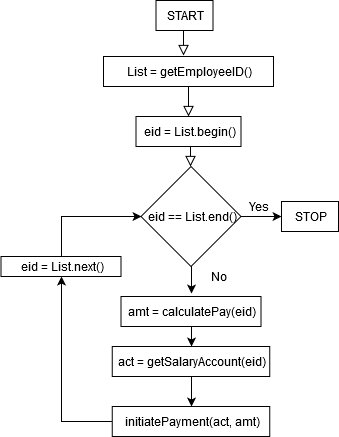

### Ouestion 1 - Part A

**Encapsulation**

Encapsulation is defined as the wrapping up of data(variables) and the code acting on the data(methods) under a single unit. In other words, it is a protective shield that prevents the data from being accessed by the code outside this shield.

In the Object Oriented notion of a class, the variables of a class are hidden from any other class and can be accessed only through any member functions of the same class in which they are declared. These functions are generally known as **getters** and **setters**.

To achieve encapsulation, the data in a class is hidden from other classes using the **data hiding** concept which is achieved by making the members variables of class as private and making them accessible to the outside world via public getter and setter methods.

#

**Good use of Encapsulation:**

The code snippet below shows an Employee class that has private fields like name, age and employeeID. These private fields are accessible to external classes via the public getter and setter methods. Here, we use the concept of data hiding to hide any sensitive data from the outside world by binding the data(variables) and the code(methods) to create a _protective shield_ for that data. The following code demostrates this idea:

```java

public class Employee 
{ 
    // private variables declared  
    // these can only be accessed by  
    // public methods of class 
    private String name; 
    private long empID; 
    private int age; 
  
    // get method to access private variable age 
    public int getAge()  
    { 
      return age; 
    } 
   
    // get method to access private variable name 
    public String getName()  
    { 
      return name; 
    } 
      
    // get method to access private variable empID 
    public long getEmpID()  
    { 
       return empID; 
    } 
   
    // set method to access private variable age 
    public void setAge(int age) 
    { 
      this.age = age; 
    } 
   
    // set method to access private variable name 
    public void setName(String name) 
    { 
      this.name = name; 
    } 
      
    // set method to access private variable empID 
    public void setEmpID(long empID)  
    { 
      this.empID = empID; 
    } 
}


public class TestEmployee 
{     
    public static void main (String[] args)  
    { 
        Employee emp = new Employee(); 
          
        // setting values of the variables  
        emp.setName("Raj"); 
        emp.setAge(23); 
        emp.setEmpID(987654321); 
          
        // Displaying values of the variables 
        System.out.println("Employee's name: " + emp.getName()); 
        System.out.println("Employee's age: " + emp.getAge()); 
        System.out.println("Employee's ID: " + emp.getEmpID()); 
          
	// This is NOT allowed, since name is a private field.
        // System.out.println("Employee's name: " + emp.name);         
    } 
} 
```

#

**Bad use of Encapsulation:**

Now instead of declaring the variables as private in the Employee class, if we declared them as public, then they would be freely accessible to the outside world. Any class would simply access it by instantiating the Employee class. This does not adhere to the data hiding principles as it makes sensitive data freely available to the outside world, since in this case we would not need getters and setters since the class variables themselves are public. This also means that any outside class can manipulate the Employee class' properties. The following code demonstrates this:


```java

public class Employee 
{ 
    // public variables declared are freely accessible
    public String name; 
    public long empID; 
    public int age; 
  
    // No need of setters and getters
}


public class TestEmployee 
{     
    public static void main (String[] args)  
    { 
        Employee emp = new Employee(); 
          
        // setting values of the variables directly
        emp.name = "Raj"
        emp.age = 23
	emp.empID = 987654321
	
        // Displaying values of the variables by direct access 
        System.out.println("Employee's name: " + emp.name); 
        System.out.println("Employee's age: " + emp.age); 
        System.out.println("Employee's ID: " + emp.empID);         
    } 
} 
```

(Web references used for this answer - https://www.geeksforgeeks.org/encapsulation-in-java/ and https://www.tutorialspoint.com/java/java_encapsulation.htm )
 
---

### Question 1 - Part B

**Abstraction**

Abstraction is a process of hiding the implementation details from the user, and only providing the functionality. In other words, the user will have the information on what the object does instead of how it does it.

Consider a real-life example of a man driving a car. The man only knows that pressing the accelerators will increase the speed of car or applying brakes will stop the car but he does not know about how on pressing the accelerator the speed is actually increasing, he does not know about the inner mechanism of the car or the implementation of accelerator, brakes etc in the car. This is what abstraction is.

In the Object Oriented notion, abstraction is achieved via **Abstract classes** and **Interfaces**. We can achieve 100% abstraction by using interfaces. The key difference between abstract classes and normal classes is that abstract classes **cannot be instantiated**.

#

**Good use of Abstraction:**

The code snippet below shows an abstract Employee class that has some private variables, an abstract method getSalary() and a public getters and setters. This Employee class is inherited by two other classes HourlyEmployee and MonthlyEmployee, which now need to have concrete implementations of the getSalary() method. The advantage of doing this is that since the Employee class is abstract, the outside classes do not have implementation details of the concrete methods in the Employee class. The code snippet below demonstrates this idea:

```Java

public class Employee 
{ 
    // private variables declared  
    // these can only be accessed by  
    // public methods of class 
    private String name; 
    private long empID; 
    private int age; 
  
    // Abstract method
    public abstract Double getSalary();
  
    // Concrete methods
    // get method to access private variable age 
    public int getAge()  
    { 
      return age; 
    } 
   
    // get method to access private variable name 
    public String getName()  
    { 
      return name; 
    } 
      
    // get method to access private variable empID 
    public long getEmpID()  
    { 
       return empID; 
    } 
   
    // set method to access private variable age 
    public void setAge(int age) 
    { 
      this.age = age; 
    } 
   
    // set method to access private variable name 
    public void setName(String name) 
    { 
      this.name = name; 
    } 
      
    // set method to access private variable empID 
    public void setEmpID(long empID)  
    { 
      this.empID = empID; 
    } 
}

public class HourlyEmployee extends Employee {
    private Double hourlyPay;
    private Double hoursWorked;
    
    public HourlyEmployee(hourlyPay, hoursWorked) {
      this.hourlyPay = hourlyPay;
      this.hoursWorked = hoursWorked;
    }
    
    public Double getHourlyPay() {
      return hourlyPay;
    }
    
    public Double getHoursWorked() {
      return hoursWorked;
    }
    
    // Implementation of the getSalary() abstract method
    public Double getSalary() {
      return hourlyPay*hoursWorked;
    }
}

public class MonthlyEmployee extends Employee {
    private Double monthlyPay;
    private Double daysWorked;
    
    public MonthlyEmployee(monthlyPay, daysWorked) {
      this.monthlyPay = monthlyPay;
      this.daysWorked = daysWorked;
    }
    
    public Double getMonthlyPay() {
      return monthlyPay;
    }
    
    public Double getDaysWorked() {
      return daysWorked;
    }
    
    // Implementation of the getSalary() abstract method
    public Double getSalary() {
      return monthlyPay*daysWorked;
    }
}

public class TestEmployee {

   public static void main(String [] args) {
      Employee hourlyEmployee = new HourlyEmployee(15.00, 2500.00);
      Employee monthlyEmployee = new MonthlyEmployee(2000.00, 25.00);
      System.out.println("Hourly Employe salary is " + hourlyEmployee.getSalary());
      System.out.println("Monthly Employe salary is " + monthlyEmployee.getSalary());
   }
}
```
#

**Bad use of Abstraction:**

Now instead of a single getSalary() abstract method, we had one abstract method defined for every type of employee that extends the Employee class. That is, instead of getSalary(), we have 2 abstract methods in the Employee class - getHourlySalary() and getMonthlySalary(). This constitutes a bad abstraction design as it is not truly using the power of abstraction and these methods don't really need to be abstract. The code snippet below demonstrates this idea:

```Java

public class Employee 
{ 
    // private variables declared  
    // these can only be accessed by  
    // public methods of class 
    private String name; 
    private long empID; 
    private int age; 
  
    // 2 Abstract methods
    // 1 each for 2 types of employees - Hourly and Monthly 
    public abstract Double getHourlySalary();
    public abstract Double getMonthlySalary();

    // Concrete methods
    // get method to access private variable age 
    public int getAge()  
    { 
      return age; 
    } 
   
    // get method to access private variable name 
    public String getName()  
    { 
      return name; 
    } 
      
    // get method to access private variable empID 
    public long getEmpID()  
    { 
       return empID; 
    } 
   
    // set method to access private variable age 
    public void setAge(int age) 
    { 
      this.age = age; 
    } 
   
    // set method to access private variable name 
    public void setName(String name) 
    { 
      this.name = name; 
    } 
      
    // set method to access private variable empID 
    public void setEmpID(long empID)  
    { 
      this.empID = empID; 
    } 
}

public class HourlyEmployee extends Employee {
    private Double hourlyPay;
    private Double hoursWorked;
    
    public HourlyEmployee(hourlyPay, hoursWorked) {
      this.hourlyPay = hourlyPay;
      this.hoursWorked = hoursWorked;
    }
    
    public Double getHourlyPay() {
      return hourlyPay;
    }
    
    public Double getHoursWorked() {
      return hoursWorked;
    }
    
    // Implementation of the getHourlySalary() abstract method
    public Double getHourlySalary() {
      return hourlyPay*hoursWorked;
    }
}

public class MonthlyEmployee extends Employee {
    private Double monthlyPay;
    private Double daysWorked;
    
    public MonthlyEmployee(monthlyPay, daysWorked) {
      this.monthlyPay = monthlyPay;
      this.daysWorked = daysWorked;
    }
    
    public Double getMonthlyPay() {
      return monthlyPay;
    }
    
    public Double getDaysWorked() {
      return daysWorked;
    }
    
    // Implementation of the getMonthlySalary() abstract method
    public Double getMonthlySalary() {
      return monthlyPay*daysWorked;
    }
}

public class TestEmployee {

   public static void main(String [] args) {
      Employee hourlyEmployee = new HourlyEmployee(15.00, 2500.00);
      Employee monthlyEmployee = new MonthlyEmployee(2000.00, 25.00);
      System.out.println("Hourly Employe salary is " + hourlyEmployee.getHourlySalary());
      System.out.println("Monthly Employe salary is " + monthlyEmployee.getMonthlySalary());
   }
}
```
(Web references used for this answer - https://www.geeksforgeeks.org/abstraction-in-java-2/ and https://www.tutorialspoint.com/java/java_abstraction.htm )

---

### Question 1 - Part C

**Polymorphism**

Polymorphism refers to the design that enables an object or a method to take on multiple forms. It is also applicable to methods where they can take on 
multiple forms depending on some factors.

In the context of class, Polymorphism allows us to use an instance of the child class to initialize or assign to a parent class reference variable, This type of polymorphism is also known as subtype polymorphism, as the child class will be a subtype of the parent class. 

The two other types of polymorphism are - Runtime polymorphism and Compile-time polymorphism. Runtime polymorphism occurs when a method in the parent class is overridden by the child class. Now, the function call will be resolved at runtime depending on the instance being used. It is also known as Function overriding. Compile time polymorphism includes function overloading and operator overloading.

#

**Good use of Polymorphism:**

One of the good uses of polymorphism is that it can refer to interfaces instead of implementations (using subtype polymorphism). Here the interface acts as a parent class in terms of its role, but it is not a class. In the below code, if we use a specific implementation of List\<String> such as ArrayList or LinkedList as the return type, then the method getAllModelNames() is restricted to use that specific implementation. Instead, if we use List\<String> then getAllModelNames() is given the choice of using any class implementation according to its requirement.

```java
class HondaCar {
    public List<String> getAllModelNames() {
        // method definition
    }
}
```
#

**Bad use of Polymorphism:**

Suppose the requirement is that we want to restrict the child class from overriding some methods of parent class. We cannot achieve this because of the runtime polymorphism capability available in Object-oriented programming. So, this is an example where polymorphism is used incorrectly. The below example needs to use the 'final' keyword to prevent subclasses from overriding the implementation of method1().

```java
class A {
    public void method1() {
        // Method definition
    }
}

class B extends A {
    public void method1() {
        // Method definition
    }
    // Here method1() is being overridden by the child class B
}
```


(Web Reference used for this answer - https://www.tutorialspoint.com/java/java_polymorphism.htm)

---

### Question 1 - Part D

**Cohesion**

Cohesion indicates the degree to which a class or function has a single, well-focused purpose. In the context of Object-oriented classes, if a class has low cohesion, then it means that it is performing multiple tasks. On the other hand, if it has high cohesion, then it means that it has one single and well-focused responsibility. Higher cohesiveness leads to better design. The same is applicable to methods or functions in the program.

#

**Bad use of Cohesion:**

The below code snippet shows a class with less cohesiveness which has the responsibility of multiple unrelated tasks. Here, HondaCrv class maintains a list of the customers who bought it. Logically, the task of maintaining customer names should not be the responsibility of HondaCrv class. So this class has low cohesion.


```java
class HondaCrv {
    private List<String> customerNames;
    public HondaCrv() {
        customerNames = new ArrayList<>();
    }
    public List<String> getCustomers() {
        return customerNames;
    }
    public void addCustomer(String customerName) {
        customerNames.add(customerName);
    }
    // other variables and methods definition of HondaCrv class
}
```
#

**Good use of Cohesion:**

One of the good use of cohesion is where the class has high cohesion and has only one and well-focused responsibility. The ‘HondaCrv’ class has the behavior and properties related to Honda CRV car only. The HondaCrvCustomer class has the task of maintaining a list of customers who bought Honda CRV. The Customer  class is a more high-level class that maintains the details of a single customer. All these classes have only one clear responsibility and hence have high cohesion.

```java
class HondaCrv {
    public HondaCrv() {
        // initializations done here
    }
    // other variables and methods definition of HondaCrv class
}

class Customer {
    private String name;
    public Customer() {
        // initializations done here
    }
    public void setName(String name) {  this.name = name;  }
}

class HondaCrvCustomers {
    private List<Customer> customers;
    public HondaCrvCustomers() {
        // initializations done here
    }
    public List<Customer> getCustomers() {
        return customers;
    }
    public void addCustomer(Customer customer) {
        customers.add(customer);
    }
}
```
(Web reference used for this answer - https://sanaulla.info/2008/06/26/cohesion-and-coupling-two-oo-design-principles/)

---

### Question 1 - Part E

Coupling refers to the interdependency between different software components such as
methods, classes, modules etc. We typically require weak coupling for better maintenance
of the code. Following code snippets exemplify strong and weak coupling respectively.

Register class keeps minimum information about students namely name and hometown.
Query class is used to get hometown from the Register given student ID. If we want to
modify Register to include a piece of extra information say the department of each
student right after the name then we need to update the addStudent method of Register
class. We also need to update the getHomeTown of Query class as the index of hometown
changed due to the insertion of new information into the list. This happens because
class Query implementation is dependent on Register data. This dependency can be
removed if we add the getHomeTown method into Register class itself and forward the call
from Query class as done in CASE 2. Thus all changes will be in the Register class and
Query class can remain the same.

#

**Bad use of Coupling:**
```java
// CASE 1: STRONG COUPLING
public class Register {
	private HashMap<Integer, List<String>> students_;

	public void addStudent(Integer sid, String name, String hometown)
	{
		List<String> student = new ArrayList<>();
		student.add(name);
		// If we add department here, getHomeTown of Query class need to be updated
		student.add(hometown);
		students_.put(sid, student);
	}

	public HashMap<Integer,List<String>> getStudentRegister()
	{
		return students_;
	}
}

class Query {
	private Register register_;

	public Query(Register register)
	{
		register_ = register;
	}

	public String getHomeTown(Integer sid)
	{
		Map<Integer,List<String>> students = register_.getStudentRegister();
		List<String> student = students.get(sid);
		if(student != null)
		{
			return student.get(1);
		}
		return "SID not found";
	}
}
```
#

**Good use of Coupling:**
```java
// CASE 2: WEAK COUPLING
public class Register {
	private HashMap<Integer, List<String>> students_;

	public void addStudent(Integer sid, String name, String hometown)
	{
		List<String> student = new ArrayList<>();
		student.add(name);
		// If we add department here, NO changes in Query class is needed
		student.add(hometown);
		students_.put(sid, student);
	}

	public String getHomeTown(Integer sid)
	{
		List<String> student = students_.get(sid);
		if(student != null)
		{
			return student.get(1);
		}
		return "SID not found";
	}
}

class Query {
	private Register register_;

	public Query(Register register)
	{
		register_ = register;
	}

	public String getHomeTown(Integer sid)
	{
		return register_.getHomeTown(sid);
	}
}

```
(Web references used for this answer - https://www.geeksforgeeks.org/coupling-in-java/ and https://blog.ndepend.com/programming-coupling/ )

---

### Question 1 - Part F

**Identity**

Object identity is the property by virtue of which an object is uniquely identified.
Quite often we can identify the object with its memory location, unique integer
associated with it, etc. Care must be taken to distinguish objects that hold the
same values and identical objects.

#

**Bad use of Identity:**

Consider a class with a single field of type String which is initialized by
the argument passed to its constructor. Suppose in a payroll system we want to use
this object (i.e. value it holds in String field) to represent employees.
If we use the name of the employee to create objects, the system might fail
because two employees can have the exact name. So, such an association of object
identity with employee name is futile.

#

**Good use of Identity:**

On the other hand if we use employee ID, which is ensured to be unique for each
employee, for object creation; each object can be assumed to represent the
unique employee.

(No references used for this answer.)

---

### Question 2

**Payroll System - Functional Decomposition Approach**

#

The following methods depict the functional decomposition approach to the
implementation of a payroll system.

```java
// Return a list of IDs of all the employees that need to be paid
List getEmployeeID()

// Identify the type of the employee i.e. hourly or monthly
String getEmployeeStatus(Employee ID)

// Number of hours worked by an hourly employee
Double payableHours(Employee ID)

// Number of days worked by the monthly employee
Double payableDays(Employee ID)

// Calculate payment for an hourly employee
Double calculatePayHourly(Employee ID)
	return payableHours(Employee ID) times hourly payment

// Calculate payment for monthly employee
Double calculatePayMonthly(Employee ID) 
	return payableDays(Employee ID) times per day payment

// Calculate payment of an employee
Double calculatePay(Employee ID)
	If getEmployeeStatus(Employee ID) is hourly
		return calculatePayHourly(Employee ID)
	else
		return calculatePayMonthly(Employee ID)

// Retrieve salary account details of an employee
Account getSalaryAccount(Employee ID)

// Initiate payment of the specified amount to the specified account
void initiatePayment(Account acc, Double amount)
```

The above functions assume that all the relevant information is available in the
database. Such as hourly and per day payment amount, salary account of all the employees.
It’s also assumed that suitable database API is available for high-level queries such as
fetching employee ID and status.

The following flowchart depicts the high-level flow of the main function of the
payroll system.

<p align="center">
  
</p>

---

### Question 3

**Payroll System - Object Oriented Approach**

#

**The Design**

Using Object Oriented Paradigm, a payroll management system can be designed using the following classes:

* **Employee**: This abstract class (italicized in the class diagram) represents an Employee of the organization. It consists of private fields like name, age, employee ID (eid), etc. that are particular to each employee. It also consists of getter methods that allow access to private fields of this class. Additionally it also has an abstract method - getPay, which gets the amount of money to be paid to employees based on their status.

  * HourlyEmployee: A subclass of the Employee class, this class represents an hourly employee of the organization. It consists of a private field namely “hourlyPay” which signifies the hourly pay of that particular employee and getters to provide access to the private fields of this class.

  * MonthlyEmployee: Also a subclass of the Employee class, this class represents a monthly employee of the organization. It consists of a private field namely “monthlyPay” which signifies the monthly pay of that particular employee and getters to provide access to the private fields of this class.

* **PayrollManagementSystem**: This class represents the Payroll system that is being used by the organization. It has public fields like version and policy and a host of public functions. This system can be thought of as a dashboard presented to employees and accountants in a real-world application. Some of the functions that it performs are:

  * authorizeEmployee and authorizeAccountant: Authorizes the user using the eid and password fields.

  * getUserDetails: Gets the Employee details using eid.

  * getPaymentDetails: Gets payment details of the employee using eid. Returns a SalaryAccount object. 

  * initiatePayment: Makes a payment to the Employees bank account using the SalaryAccount object previously retrieved. Returns the transaction ID of the transfer.

  * recordTransaction: Records the transaction details using the transaction ID into the database.

  * fileDiscrepancy: Allows employees to file a discrepancy in their salary calculation using the transaction ID.

  * displaySalaryDetails: Display salary details to the employee.

* **Accountant**: This class represents the accountants in the organization who perform the following functions:

  * getEmployeeList: Get the list of all employee IDs.

  * calculateTax: Calculate tax for each employee.

  * calculateAllowance: Calculate allowance for each employee.

  * calculateGrossSalary: Calculate the gross salary for each employee.

  * issueSalary: Issue the salary to each employee by adding it to the database.

* **SalaryAccount**: This class represents the bank account details of an employee with private fields like accountNumber, routingNumber, bankBranchID. It also has a getter method that returns the account details for an employee.

Following figure depicts the payroll management system as a class diagram:

<p align="center">
  
</p>

We can observe from the above description and class diagram that the fundamental OO properties, namely, Abstraction, Encapsulation, Inheritance and Polymorphism are inherent in the system. 

#

**Class Instantiation Sequence**

Here we’re assuming the presence of a “Main” class in order to execute this system in an OO based language.

1. **Employee** and **SalaryAccount**: The main class will first create multiple instances of the Employee class, which basically represents all the employees in the organization. Since each employee has a bank account associated with them, we will also instantiate SalaryAccount for each instance of the Employee class.

2. **Accountant**: Next, we will instantiate multiple instances of the Accountant class, which represent the accountants in the organization. Each accountant has a set of Employees for whom they need to calculate the gross salary and then upload the gross salary to the database.

3. **PayrollManagementSystem**: Finally, we will instantiate the PayrollManagementSystem class that will perform the duties of issuing the salary to the Employee bank accounts as well as allow the employees to retrieve their salary information and raise any discrepancies.

#

**Interaction Among Classes**

1. Each instantiation of the Employee class also instantiates a SalaryAccount object that stores the bank account details of that employee. (“has a” relationship)

2. The HourlyEmployee and MonthlyEmployee classes extend the abstract Employee class to instantiate employees based on their status.

3. Employee class uses the PayrollManagementSystem to get salary details and file discrepancies.

4. The Accountant class uses the getPay() method to get the payable amount for each Employee instance.
